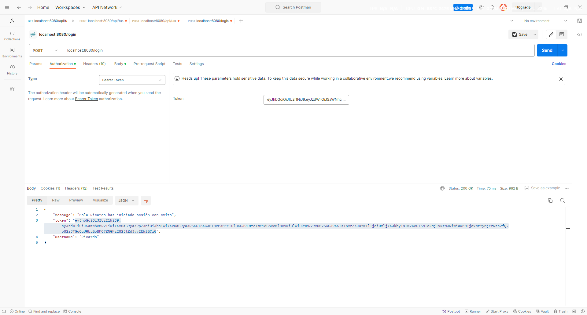
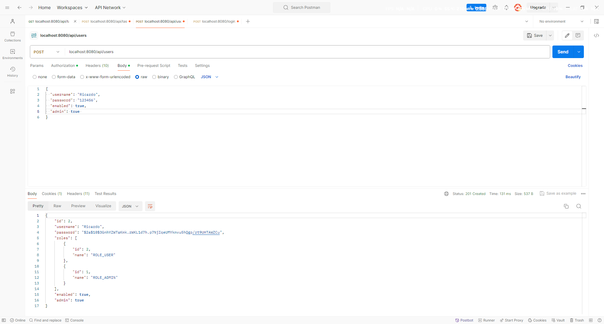
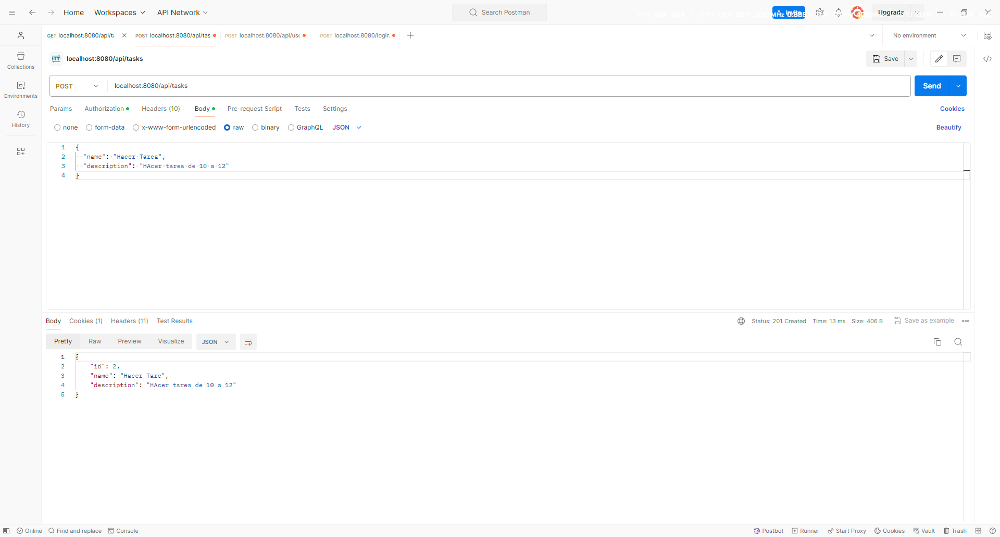
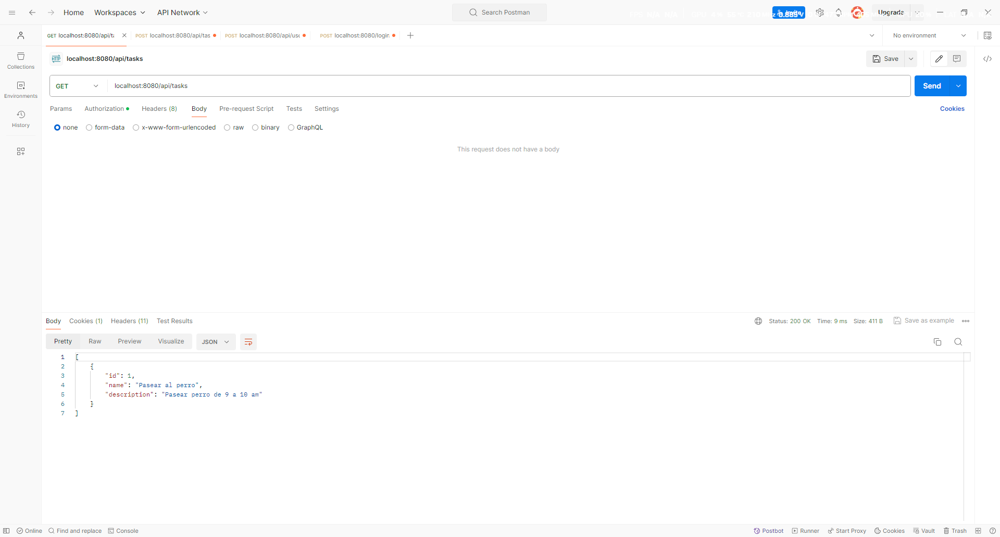
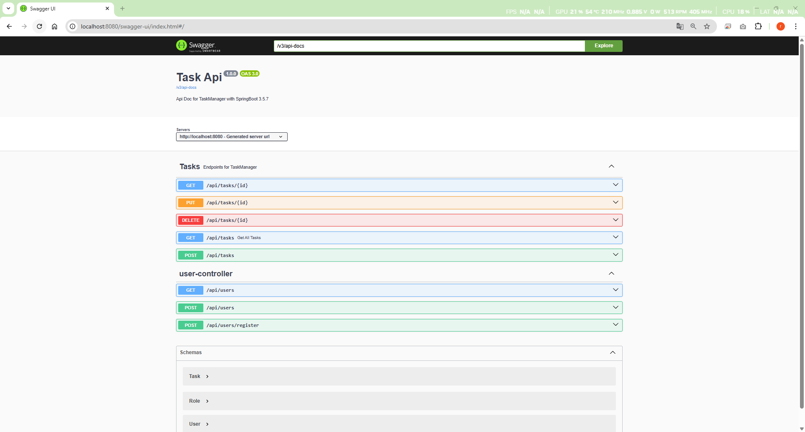

# Proyecto: Task Manager – Taller Java HITS Ricardo León 

Este proyecto forma parte del **Taller de Java HITS** y tiene como objetivo desarrollar un gestor de tareas (Task Manager) con funcionalidades básicas de creación, edición y eliminación de tareas.

## 📸 Capturas de pantalla

A continuación se muestran algunas imágenes del funcionamiento del proyecto.

---
